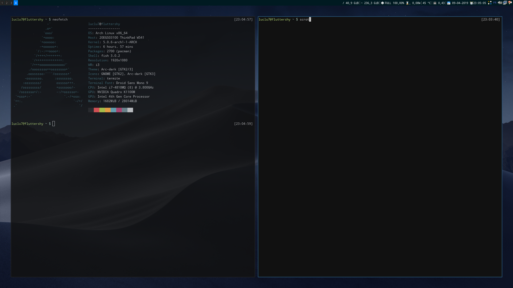

# Dotfiles
<h1 align="center"><br>

<br><br>
</h1>

Those are ~all my dotfiles, install them if you want via GNU Stow:
```
git clone https://github.com/luclu7/dotfiles ~/dotfiles
cd ~/dotfiles
stow -v vim
stow -v i3
stow -v termite
stow -v bins
stow -v fish
git clone https://github.com/VundleVim/Vundle.vim.git ~/.vim/bundle/Vundle.vim
git clone https://github.com/luclu7/polybar-scripts ~/polybar-scripts
vim +:PluginInstall
```

There's two branches for my main laptop (W541) and my secondary laptop (X240):
* master
* x240

Dependencies:
* j4-dmenu-desktop
* rofi
* termite
* udiskie
* polybar
* [xcwd](https://github.com/schischi/xcwd)
* gnome-screenshot
* pa-applet
* xbacklight
* mpd/mpc
* python
* redshift
* gnome-keyring
* vim
* fzf

Screenshot:

